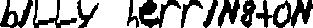
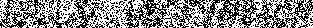
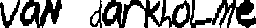
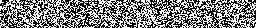
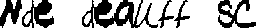
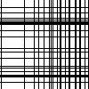
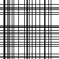
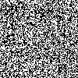
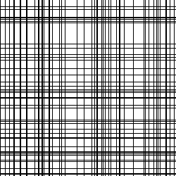

# Statistical Methods of Pattern Recognition
Laboratory work from the university course.

## Setup

To run these applications you need to have **Python3.10**.

1. Clone repo:
```bash
git clone https://github.com/maksymshylo/computational_geometry.git
```
2. Create virtual environment.
```bash
python3.10 -m venv .venv
```
3. Activate it
```bash
source .venv/bin/activate
```
4. Install requirements:
```bash
pip install -r requirements.txt
```

## Lab 1 - Recognition of a noised image.

### Description
> The program converts a string to noised image and then decodes it.

### Usage
```commandline
 $ python3 lab1/decode_string.py --help
usage: decode_string.py [-h] --input_string INPUT_STRING --noise_level NOISE_LEVEL [--seed SEED]

options:
  -h, --help            show this help message and exit
  --input_string INPUT_STRING
                        input string
  --noise_level NOISE_LEVEL
                        noise level of bernoulli distribution
  --seed SEED           seed to debug
```

### Examples
```bash
python3 lab1/generate_string.py --input_string "billy herrington" --noise_level 0.35 --seed 45
```
Decoded string:  "billy herrington"

| Original image                        |           Noised image           | Decoded image                     |
|---------------------------------------|:--------------------------------:|-----------------------------------|
|  |  |  |

```bash
python3 lab1/generate_string.py --input_string "van darkholme" --noise_level 0.45 --seed 45
```
Decoded string:  "nde deauff sc"

| Original image                        |              Noised image              | Decoded image                           |
|---------------------------------------|:--------------------------------------:|-----------------------------------------|
|  |  |  |


## Lab 2 - Recognition of black vertical and horizontal lines

### Description
> The program creates an image with black vertical and horizontal lines,
> apply bernoulli noise, and denoise it.

##### `Gibbs Sampling`

### Usage
```commandline
$ python3 lab2/gibbs_sampler.py --help
usage: gibbs_sampler.py [-h] [--h H] [--w W] [--n_lines N_LINES]
                        [--noise_level NOISE_LEVEL]
                        [--column_prob COLUMN_PROB] [--n_iter N_ITER]

options:
  -h, --help            show this help message and exit
  --h H                 Height of image.
  --w W                 Width of image.
  --n_lines N_LINES     Number of horizontal and vertical lines.
  --noise_level NOISE_LEVEL
                        Noise level of bernoulli distribution.
  --column_prob COLUMN_PROB
                        Probability of column to be black.
  --n_iter N_ITER       Number of iterations for Gibbs Sampler.
```

#### Examples
```bash
python3 lab2/gibbs_sampler.py --h 100 --w 100 --n_lines 20 --noise_level 0.42 --column_prob 0.5 --n_iter 100
```
> column accuracy 91.0
> 
> row accuracy 94.0

| Original image                                                    |                           Noised image                            | Decoded image                                                     |
|-------------------------------------------------------------------|:-----------------------------------------------------------------:|-------------------------------------------------------------------|
|   |  |  |


##### `Precise solution`

### Usage
```commandline
 $ python3 lab2/precise_solution.py --help
usage: precise_solution.py [-h] --h H --w W --n_lines N_LINES --noise_level NOISE_LEVEL --column_prob COLUMN_PROB

options:
  -h, --help            show this help message and exit
  --h H                 Height of image.
  --w W                 Width of image.
  --n_lines N_LINES     Number of horizontal and vertical lines.
  --noise_level NOISE_LEVEL
                        Noise level of bernoulli distribution.
  --column_prob COLUMN_PROB
                        Probability of column to be black.
```


#### Examples
```bash
python3 lab2/gibbs_sampler.py --h 100 --w 100 --n_lines 20 --noise_level 0.42 --column_prob 0.5 --n_iter 100
```
> column accuracy 82.0
> 
> row accuracy 88.0

| Original image                                                  |                          Noised image                          | Decoded image                                                  |
|-----------------------------------------------------------------|:--------------------------------------------------------------:|----------------------------------------------------------------|
|    |  |  |


## Lab 3 - Gibbs Sampler for recognizing a noised string over another one

> Note: Lengths of string should be the same.

#### Examples
```bash
python3 row_over_row.py input_string_1 input_string_2 noise_level number_of_iterations


python3 row_over_row.py 'row'   'owr'   0.2  10
python3 row_over_row.py 'swap'  'paws'  0.33 30
python3 row_over_row.py 'hello' 'world' 0.2  20
```
##### some other examples of possible input strings with the same widths:
```
deliver <=> reviled
animal <=> lamina
depots <=> stoped
diaper <=> repaid
drawer <=> reward
looter <=> retool
murder <=> redrum
redips <=> spider
debut <=> tubed
deeps <=> speed
peels <=> sleep
serif <=> fires
steel <=> leets
````
